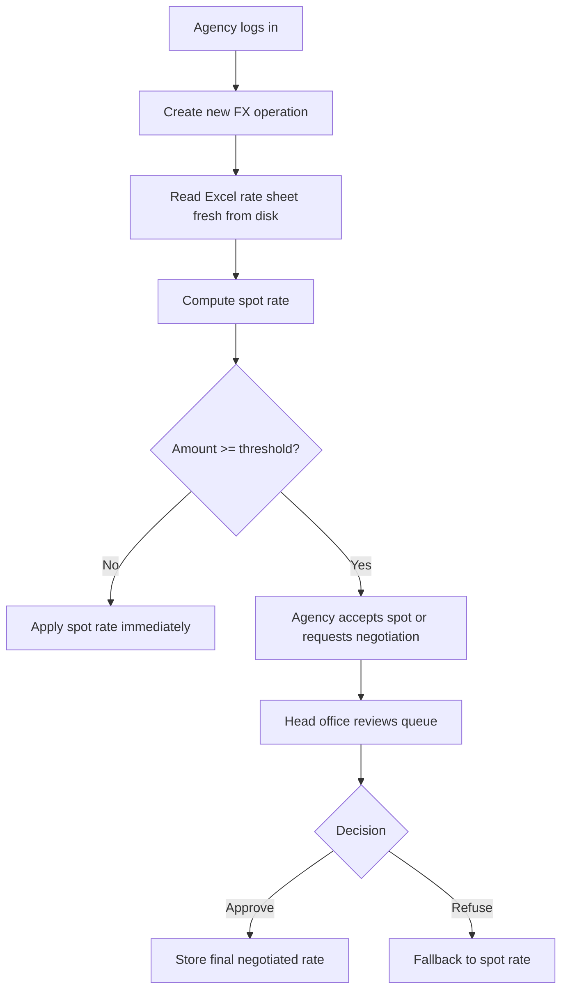

# Guichet Devises

**Version:** 1.1.0 — updated 2026-08-11

Guichet Devises is a small bank-facing FX quotation workflow application.
Agencies submit foreign-exchange operations, the app reads the bank head
office rate sheet from Excel, computes a spot rate, and decides whether the
operation can be negotiated or must be executed immediately.

The project is designed as a single Node.js app with a local SQLite database,
server-rendered EJS views, and role-based access for administration,
agencies, middle office, back office, and head office.

The account model is split into three layers:

- `admin` manages agencies and employee logins.
- `head_office` communicates with agencies and decides negotiations.
- `agency` users are employees under one agency login hierarchy.

Two read-only office roles are also available:

- `middle_office` for periodic reporting.
- `back_office` for periodic reporting.

## What the application does

The workflow is intentionally simple:

1. An agency employee signs in with their own login.
2. The agency creates a new FX operation.
3. The app reads the head office rate sheet directly from disk.
4. The app calculates the spot rate for the selected source currency versus TND.
5. If the amount is strictly less than 10000, the spot rate is applied automatically and no negotiation is allowed.
6. If the amount is 10000 or more, the agency can accept the spot rate or request an improvement from head office, optionally including a desired counteroffer rate.
7. Head office reviews pending negotiations, sees any agency requested rate, and can approve with a final rate, refuse, or return a new proposal to the agency.
8. If head office approves, the approved final rate from siege is applied.
9. If head office refuses, the agency can accept the spot rate or cancel the operation. If head office proposes another rate, the agency can accept it, send a counteroffer, or cancel.

## Recent updates

- Audit / history: all operation state changes and key actions are recorded in an `operation_audit` table and surfaced in the UI. Agencies see an operation's audit trail on the operation detail page; admins can view a full operation history at `/admin/operations/:id/history`.
- Negotiation flow improvements: agencies can submit a requested counteroffer, head office sees the requested rate when deciding, and both parties can exchange counteroffers until a final rate or cancellation.
- Account entry safety: the `Numero de compte` field now requires exactly 20 digits and must be entered twice; client-side validation prevents submission until both entries match and copy/paste is disabled for those fields.
- Session and account enforcement: sessions use rolling cookies with inactivity timeout (configurable via `.env`) and logins block disabled users/agencies.
- Office search & export: the office dashboard supports searching (ID, agency, client, status, currencies) and the Excel export respects the applied search and date filters.
- Default workbook path: the app reads the head-office rate workbook from `data/taux.xlsx` by default; the path can be changed with `RATES_FILE_PATH`.

## Technology Stack

- Node.js 22.5 or newer
- Express 5
- SQLite through Node's built-in `node:sqlite` module
- EJS server-side templates
- `express-session` for session-based authentication
- `exceljs` for reading and generating the rate workbook
- `bcryptjs` for password hashing

The app uses the native SQLite module instead of an external database driver.
The startup script includes `--experimental-sqlite` so the app runs cleanly on
the Node version targeted by the project. Seeing an SQLite experimental warning
at startup is expected in that setup.

## Project Structure

```
server.js                  Express entry point
db/index.js                SQLite schema and seed data
services/excelRates.js     Fresh Excel rate-sheet reader and spot-rate logic
services/operations.js     Business rules and operation state transitions
routes/auth.js             Login and logout routes
routes/agency.js           Agency dashboard and operation submission flow
routes/headoffice.js       Head office negotiation queue and decisions
views/                     EJS pages and shared partials
public/css/style.css       Application styling
data/taux.xlsx             Default head-office rate sheet
data/make_sample_rates.js  Helper to regenerate the sample rate workbook
```

## Application Architecture

### Entry point

[`server.js`](server.js) configures Express, sessions, static assets, and view
rendering. It mounts four route groups:

- `/login`, `/logout` for authentication
- `/agence` for agency users
- `/siege` for head-office users
- `/office` for middle office and back office users

The root route redirects authenticated users to the correct dashboard based on
their role.

### Authentication and authorization

[`routes/auth.js`](routes/auth.js) authenticates users against the SQLite
`users` table. Successful login stores the user in the session. Access control
is handled in two layers:

- `requireAuth` blocks anonymous access
- each role route group also checks the expected role

The available roles are:

- `admin` for agency and employee administration
- `head_office` for negotiation decisions
- `middle_office` for reporting access
- `back_office` for reporting access
- `agency` for agency employees

### Business logic

[`services/operations.js`](services/operations.js) contains the core state
machine for FX operations:

- create a new operation
- accept the spot rate
- request negotiation
- approve or refuse a negotiation

The negotiation threshold is centralized in `NEGOTIATION_THRESHOLD` and is set
to 10000.

### Rate-sheet access

[`services/excelRates.js`](services/excelRates.js) reads the Excel workbook
fresh from disk every time a spot rate is needed. There is no caching, which
means a file update by head office is reflected immediately on the next query.

The expected workbook columns are:

- `Devise`
- `Achat`
- `Vente`
- `DateMaj`

The default internal workbook path is `data/taux.xlsx`, and the file is read fresh from disk on every rate lookup.

The rate convention is:

- client buys foreign currency -> bank sells currency -> use the bank `Vente` rate
- client sells foreign currency -> bank buys currency -> use the bank `Achat` rate

### Persistence

[`db/index.js`](db/index.js) creates and seeds the database on startup.
It creates four tables:

- `agencies`
- `users`
- `devises`
- `operations`

Seed data includes 101 agencies (`000` to `100`), a small set of currencies,
and demo users for the admin, the head office, and three agencies.

Agencies and users are soft-disabled instead of deleted, so historical
operations remain readable.

## Data Model

### Agencies

Each agency is identified by a three-digit code such as `000` or `045`.
The agency name is stored separately for display in the UI.

### Users

Users have one of three roles:

- `admin`
- `agency`
- `head_office`

Agency users are tied to a single agency code. Head-office users are global.
Admin users are global and manage agencies plus employee accounts.

### Currencies

The `devises` table stores supported currency codes and display names. The
current seed includes:

- TND
- USD
- EUR
- GBP
- JPY
- CAD
- CHF

### Operations

An operation stores the full FX request and its life cycle:

- agency, client, account number, direction, source currency, target currency, value date, amount
- spot rate computed from the Excel workbook
- final rate once the workflow is decided
- negotiation request rate, if any
- status and decision metadata

Typical status values are:

- `spot_only`
- `spot_pending_choice`
- `pending_negotiation`
- `negotiation_approved_pending_agency`
- `negotiation_approved`
- `negotiation_refused_pending_agency`
- `negotiation_refused_accepted`
- `negotiation_cancelled_by_agency`

The `operations` table also stores `requested_taux` when the agency submits a desired counteroffer during negotiation.

## User Flows

### Agency flow

The agency dashboard shows the agency's own operations and the live rate-sheet
snapshot. The agency can:

- create a new operation
- open an existing operation
- accept the spot rate immediately
- request an improvement when the amount is eligible

The agency can only access operations belonging to its own agency code.

### Head-office flow

The head-office dashboard shows all pending negotiations. Head office can:

- review the queue of operations waiting for a decision
- inspect all operations in the system
- see the agency's requested counteroffer before deciding
- approve a negotiation with a final rate
- refuse a negotiation, return a new proposal, or send it back to the agency for final acceptance or cancellation

### Office flow

The office dashboard is available to `middle_office` and `back_office` users.
They can:

- review every operation across all agencies
- filter operations by date range
- download an Excel report for the selected period

## Rate Sheet Format

The app expects a workbook similar to the sample generated in
[`data/make_sample_rates.js`](data/make_sample_rates.js).

Example:

| Devise | Achat | Vente | DateMaj    |
| ------ | ----: | ----: | ---------- |
| USD    | 3.095 | 3.135 | 2026-08-03 |
| EUR    | 3.375 | 3.420 | 2026-08-03 |

The workbook path is configured with `RATES_FILE_PATH` in `.env`. The
default is `./data/taux.xlsx`. If the file changes on disk, the
next request will immediately use the new values.

## Configuration

Copy the sample environment file and adjust the values if needed:

```bash
cp .env.example .env
```

The available settings are:

- `PORT` - HTTP port used by the app, default `3000`
- `SESSION_SECRET` - session signing secret
- `RATES_FILE_PATH` - path to the Excel workbook containing the bank rates

## Installation and Run

```bash
npm install
node data/make_sample_rates.js
npm start
```

The app will be available at `http://localhost:3000`.

Requirements:

- Node.js 22.5 or newer
- a valid `.env` file
- a readable rate workbook at the path configured by `RATES_FILE_PATH`

## Demo Accounts

| User           | Password    | Role                       |
| -------------- | ----------- | -------------------------- |
| `admin`        | `admin123`  | Administration             |
| `siege`        | `siege123`  | Head office decision maker |
| `frontoffice`  | `office123` | Front Office (Siege)       |
| `middleoffice` | `office123` | Middle Office reporting    |
| `backoffice`   | `office123` | Back Office reporting      |
| `agence000`    | `agence123` | Agency 000                 |
| `agence001`    | `agence123` | Agency 001                 |
| `agence045`    | `agence123` | Agency 045                 |

These accounts are seeded on first launch together with the agencies and
supported currencies. The admin account creates and disables agencies and
employee logins.

## Screens

The main UI pages are:

- login screen
- admin dashboard
- agency dashboard
- new operation form
- operation detail page
- head-office pending negotiations dashboard
- head-office all-operations view
- head-office negotiation decision page
- office dashboard and Excel export
- shared error page

The app computes the spot rate from the head-office Excel workbook. If the
client buys the source currency, the bank `Vente` rate is used. If the client
sells the source currency, the bank `Achat` rate is used.

In this project, TND is always the target currency and the source currency is
the one selected by the agency.

That logic is implemented in [`services/excelRates.js`](services/excelRates.js).

## Business Rules

1. The agency enters the operation details.
2. The system validates the form fields and the amount.
3. The system reads the current Excel rate sheet.
4. The spot rate is stored with the operation.
5. If the amount is below `NEGOTIATION_THRESHOLD`, the operation is marked as spot-only.
6. If the amount meets or exceeds the threshold, the operation is left in a state where the agency can choose spot acceptance or negotiation.
7. Head office decides whether the negotiation is approved or refused.
8. If head office refuses, the agency can accept the spot or cancel the operation.

The threshold is intentionally centralized in [`services/operations.js`](services/operations.js) so it can be changed in one place.

## Typical Request Lifecycle



## Maintenance Notes

- The SQLite database is stored locally in `db/bank.sqlite` and is created automatically.
- Journal mode is set to WAL for better concurrent read/write behavior.
- The app migrates the local database schema so admin and TND changes keep existing data readable.
- The app does not currently expose an API layer; the UI is server-rendered.
- There is no automated test suite yet. `npm test` is only a placeholder.

## Possible Extensions

- Replace demo credentials with LDAP or SSO integration.
- Add a real FX conversion layer so the negotiation threshold can be compared in a base currency.
- Add audit history for rate changes and negotiation decisions.
- Add export/reporting features for finance and accounting teams.
- Add automated tests for the rate reader, operation workflow, and role access control.

## Troubleshooting

- If the app cannot find the rate workbook, verify `RATES_FILE_PATH` in `.env`.
- If login fails, check that the seeded users still exist in the database.
- If you change the workbook format, keep the header names exactly as expected.
- If the app fails to start on an older Node version, upgrade to Node 22.5 or newer.
